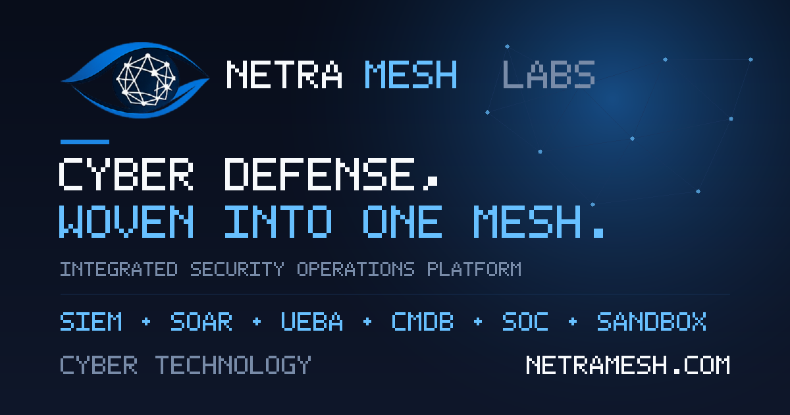

<p align="center">
  
</p>

<h1 align="center">NetraMesh Labs — Corporate Website</h1>

<p align="center">
  <em>Cyber defense, woven into one mesh.</em><br />
  Marketing &amp; branding site for an integrated security operations platform.
</p>

<p align="center">
  
  
  
  
  
</p>

---

A fully **static, secure, bilingual (EN / ID)** corporate website for **NetraMesh Labs** —
showcasing a cyber-tech product suite: **SOC Dashboard, SIEM, SOAR, UEBA, CMDB, Case
Management, Incident Response, Sandboxing, and Vulnerability Management**.

No backend, no login, no database, no cookies, no trackers — just HTML, CSS, and vanilla JS.
Built for branding, so it's fast, private, and trivially cheap to host.

> 🌐 **Production:** [netramesh.com](https://netramesh.com)

---

## ✨ Highlights

- **Dark-first cyber-tech theme** built on the official brand palette.
- **Animated mesh hero** (HTML canvas) with travelling packets + cursor spotlight — a literal nod to "NetraMesh".
- **Live SOC console** that types simulated detection→response events, plus a live *"threats blocked today"* counter (all client-side, no real data).
- **Interactive product preview** — an app-window mockup with **9 switchable dashboards**: SOC Overview, SIEM Events, Vulnerability Posture, Case Management (kanban), CMDB graph, SOAR playbook, UEBA timeline, Sandboxing report, Incident Response runbook. Every product card jumps to its matching view.
- **Command palette** (`/` or `Ctrl/⌘+K`) for keyboard navigation.
- **Bilingual EN / ID** toggle, **scroll-spy** nav highlighting, scroll-reveal, animated counters, 3D-tilt cards, magnetic buttons.
- **Accessible & motion-aware** — skip link, focus states, semantic landmarks, honors `prefers-reduced-motion`.
- **Secure by default** — strict Content-Security-Policy (`'self'` only, no `unsafe-inline`), HSTS, anti-clickjacking, locked-down `Permissions-Policy`.

## 🎨 Brand palette

| Token | Hex | Usage |
|---|---|---|
| Deep Cyber Blue | `#1565C0` | primary CTA, mesh icon, highlights |
| Electric Blue | `#1E88E5` | hover, accents, active links, glow |
| Dark Navy | `#0F172A` | text, navbar, dark sections |
| Charcoal | `#1E293B` | card surfaces, menu |
| Slate Gray | `#64748B` | subtitles, secondary text |
| Light Gray | `#E2E8F0` | borders, dividers |
| Pure White | `#FFFFFF` | text on dark, spacing |

## 🧱 Tech stack

Plain **HTML + CSS + vanilla JavaScript**. **Zero** runtime dependencies, no CDN, no fonts
fetched from third parties — everything is self-hosted, which is what keeps the CSP genuinely
`'self'`-only. Brand images are generated programmatically by a pure-Python script (no Pillow,
no ImageMagick).

## 📂 Structure

```
netramesh-website/
├── index.html              # the single-page site
├── assets/
│   ├── css/styles.css
│   ├── js/main.js
│   └── img/                # logo-icon · favicon · apple-touch-icon · og-image · master logo
├── tools/build-assets.py   # regenerates the icon/favicon/OG image from the master logo
├── .htaccess               # security headers + canonical (non-www) + HTTPS redirect (Apache/cPanel)
├── .cpanel.yml             # cPanel Git deployment (copies prod files to public_html)
├── _headers                # security headers for Netlify / Cloudflare Pages (optional)
├── robots.txt · sitemap.xml
├── README.md               # you are here
└── DEPLOY-cpanel.md         # step-by-step cPanel / GitHub deployment guide
```

## 🚀 Run locally

It's pure static — any static server works:

```bash
cd netramesh-website
python3 -m http.server 8080
# open http://localhost:8080
```

> Serve over HTTP (not `file://`) so the strict CSP and the canvas animation behave correctly.

## 🌐 Deploy

Primary target is **cPanel (Apache)** via **GitHub** — push, then in cPanel *Update from Remote*
→ *Deploy HEAD Commit*. The included `.cpanel.yml` copies only the production files into
`public_html`; dev files and the master logo stay in the repo.

📖 **Full walkthrough:** see **[`DEPLOY-cpanel.md`](DEPLOY-cpanel.md)** (DNS, AutoSSL, upload/extract,
Git Version Control setup, troubleshooting).

Also deployable as-is to **Netlify / Cloudflare Pages** (drag-drop the folder — `_headers` applies
automatically) or any **Nginx/Apache** host.

## 🔒 Security

- **Strict CSP** — `default-src 'self'`; no inline scripts/styles, no external origins.
- **No data leaves the browser** — the "Request Demo" form composes a `mailto:` link client-side;
  nothing is stored or transmitted by the site. The only thing persisted is a UI language
  preference in `localStorage`.
- **HSTS + HTTPS redirect**, `X-Frame-Options: DENY`, `nosniff`, restrictive `Permissions-Policy`,
  cross-origin isolation headers, server-token suppression (see `.htaccess` / `_headers`).
- After deploy, validate at [securityheaders.com](https://securityheaders.com) and
  [Mozilla Observatory](https://observatory.mozilla.org).

## 🛠️ Customization

- **Colors:** edit the `:root` tokens at the top of `assets/css/styles.css`.
- **Copy / translations:** every translatable element carries `data-en` and `data-id` attributes
  in `index.html` — edit both. The visible default text matches `data-en`.
- **Contact email:** search `hello@netramesh.com` in `index.html` and `assets/js/main.js`.
- **Products / dashboards:** duplicate a `.card` (and its matching `.dashview` + tab) in `index.html`.
- **Brand assets:** drop a new master logo at `assets/img/NetraMeshLabs.png`, then run
  `python3 tools/build-assets.py` to regenerate `logo-icon.png`, `favicon.png`,
  `apple-touch-icon.png`, and `og-image.png`.

## 🌍 Languages

The UI ships in **English** and **Bahasa Indonesia**; visitors switch with the EN/ID toggle in
the navbar (or the command palette). The choice is remembered locally — it is not sent anywhere.

## 📄 License

© 2026 NetraMesh Labs. All rights reserved. *(Add a `LICENSE` file if you intend to open-source it.)*

<p align="center"><sub>Built for cyber hygiene &amp; resilience — without the paywall.</sub></p>
